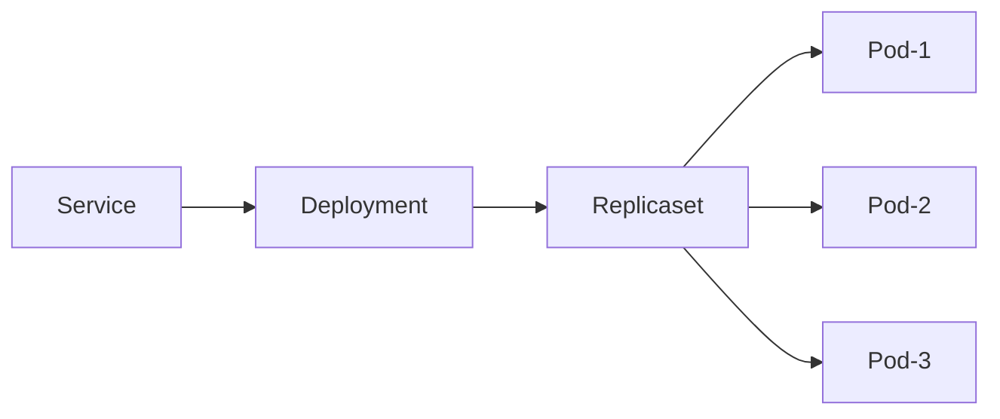

# Rolling updates

## Environment - Rancher desktop

We are using Rancher Desktop as our default kubernetes environment. It is recommended to have enough memory and cpu. To increase the values you can click on the left wheel and in the Virtual Machine option, configure the CPUs and Memory values.
Also sometimes Rancher desktop can crash or get a connection refused. If so, I recommend restarting the kubernetes cluster or a factory reset. BUT, keep in mind that all containers and configurations will be deleted.


## Overview

Kubernetes Rolling Update strategy is to replace old pods with new one gradually, while continuing to serve clients without incurring downtime.

* **RollingUpdate**: new pods are added gradually, and old pods are terminated gradually.
* **Recreate**: all old pods are terminated before any new pods are added.





## Example using Nginx

* Initially all pods are running Nginx 1.21-alpine and the Service routes the traffic to these pods.
* During the rolling update, kubernetes takes down some Nginx 1.21-alpine pods and creates corresponding new Nginx 1.23-alpine pods based on `maxUnavailable` and `maxSurge`.
* Two Nginx 1.21-alpine pod is taken down, and two Nginx 1.23-alpine pod is created. Kubernetes will not route the traffic to any of them because their **readiness probe is not yet successful**.
* When the new Nginx 1.23-alpine pod is ready as determined by the readiness probe, kubernetes will start routing the traffic to it. This means during the update process, users may see both the old service and the new service.
* The rolling update continues by taking down Nginx 1.21-alpine pods and creating Nginx 1.23-alpine pods, and then routing the traffic to the ready pods. Finally, all pod are on Nginx 1.23-alpine.

### Strategy - YAML

```yaml
strategy:
  type: RollingUpdate
  rollingUpdate:
    maxSurge: 25%
    maxUnavailable: 25%
progressDeadlineSeconds: 600
```

* `maxUnavailable`: the maximum number of pods that can be unavailable during the update process. This can be an absolute number or percentage of the replicas count.
* `maxSurge`: the maximum number of pods that can be created over the desired number of pods. Again this can be an absolute number or a percentage of the replicas count.


#### Readiness - YAML

```yaml
readinessProbe:
  initialDelaySeconds: 1
  periodSeconds: 3
  failureThreshold: 3
  successThreshold: 1
  httpGet:
    path: /
    port: 80
    httpHeaders:
    - name: x-k8s-sandbox
      value: readiness
```

* `readinessProbe`: for your service container to help Kubernetes determine the state of the pods. Kubernetes will only route the client traffic to the pods with a healthy liveness probe.
	* `initialDelaySeconds`: number of seconds after the container has started before readiness probes are initiated.
	* `periodSeconds`: how often (in seconds) to perform the probe. Default to 10 seconds. Minimum value is 1.
	* `timeoutSeconds`: number of seconds after which the probe times out. Defaults to 1 second. Minimum value is 1.
	* `successThreshold`: minimum consecutive successs for the probe to be considered successful after having failed. Default to 1. Minimum value is 1.
	* `failureThreshold`: Minimum consecutive failures for the probe to be considered failed after having succeeded. Defaults to 3. Minimum value is 1.

#### Lifecycle - YAML

```yaml
lifecycle:
  preStop:
    exec:
      command:
        - /bin/sleep
        - "20"
```

* `preStop`: this hook is called immediately before a container is terminated due to an API request or management event such as a *liveness/startup* probe failure, preemption, resource contention and others.


## DEMO

You can use `siege` to make requests to your endpoint.

```shell
siege -v <your-IP>:<your-port> -c2
```

Using `watch` command you can visualize how the pods are terminating and also creating the new ones:

```shell
watch kubectl get all
```

To deploy your deployments the command is the follow:

```shell
kubectl deploy -f <name-of-your-file>
```

To pull the docker image on M1 you first need to run:

```shell
docker pull --platform=linux/amd64 vergauwensimon/ktor-native-server:tag
```
